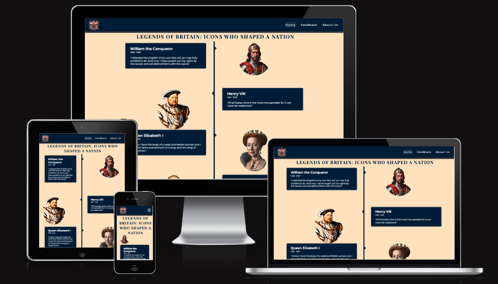

# Great Britain: Through Time

Visit the deployed site: [Great Britain: Through Time](https://deepeshpatel11.github.io/Great-Britain-Through-Time/)

Great Britain: Through Time is a captivating journey through the history of the United Kingdom, highlighting the lives and legacies of ten influential figures who shaped the nation. From William the Conqueror to Margaret Thatcher, our platform provides an immersive experience into the stories of Britain's most iconic individuals.

Did you know that these historical figures have left an indelible mark on British history? Our timeline showcases their achievements, quotes, and pivotal moments, making it an engaging resource for history enthusiasts and learners alike.

Our platform allows users to delve into the past from the comfort of their homes, bringing history to life with engaging content, timelines, and multimedia elements. Whether you are a student, educator, or history buff, Great Britain: Through Time is your go-to destination for exploring the rich history of the United Kingdom.

Join us in celebrating the legacy of Britain's most influential figures and deepen your understanding of how they have shaped the world we live in today.

## Contents

## User Experience (UX)

### User Stories

#### First Time Visitor Goals

* I want to explore the lives and achievements of significant historical figures from Britain, so that I can learn more about the country's history and its influential personalities.
* I want the site to be responsive on any device I am using.
* I want to be able to navigate the webpage with ease.

#### Returning Visitor Goals

* I want to easily find detailed information and timelines of historical events associated with specific figures, so that I can deepen my understanding of their contributions and historical context.

#### Frequent Visitor Goals
* I want to have access to sufficient content that will necessitate more than one viewing, so that I can continue to learn and discover new information each time I visit the site.