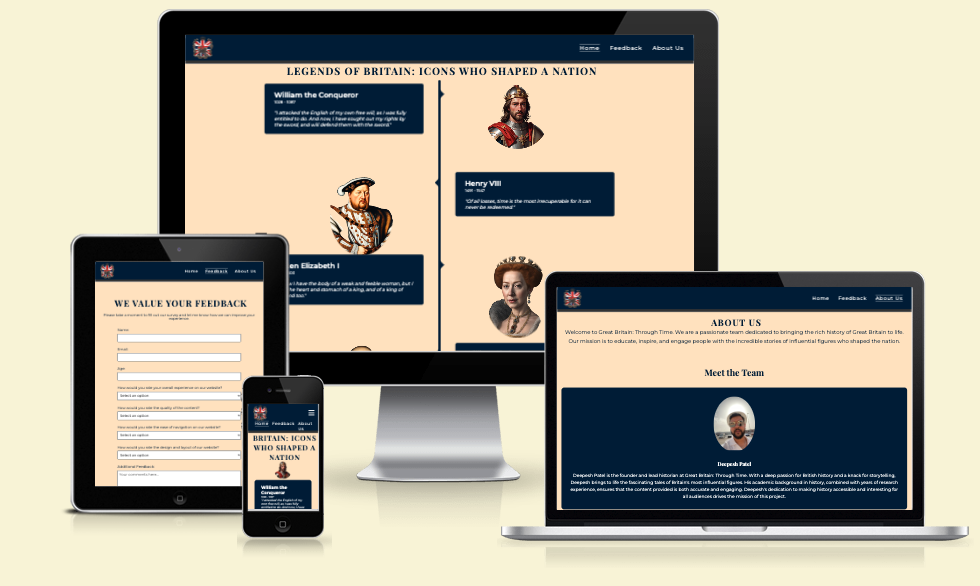
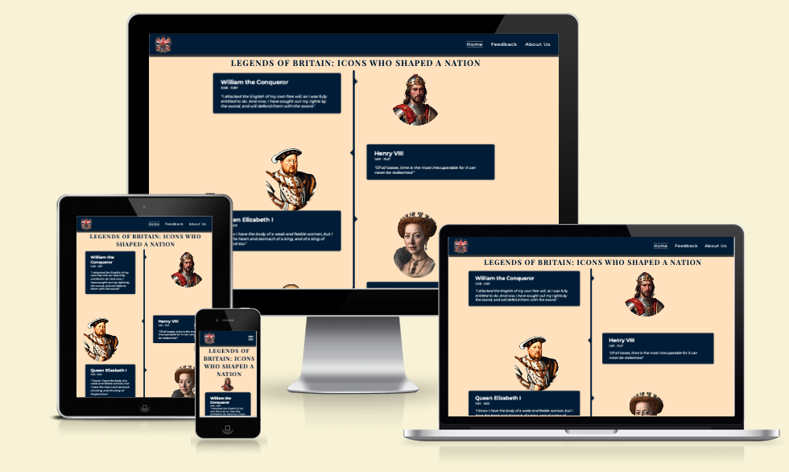
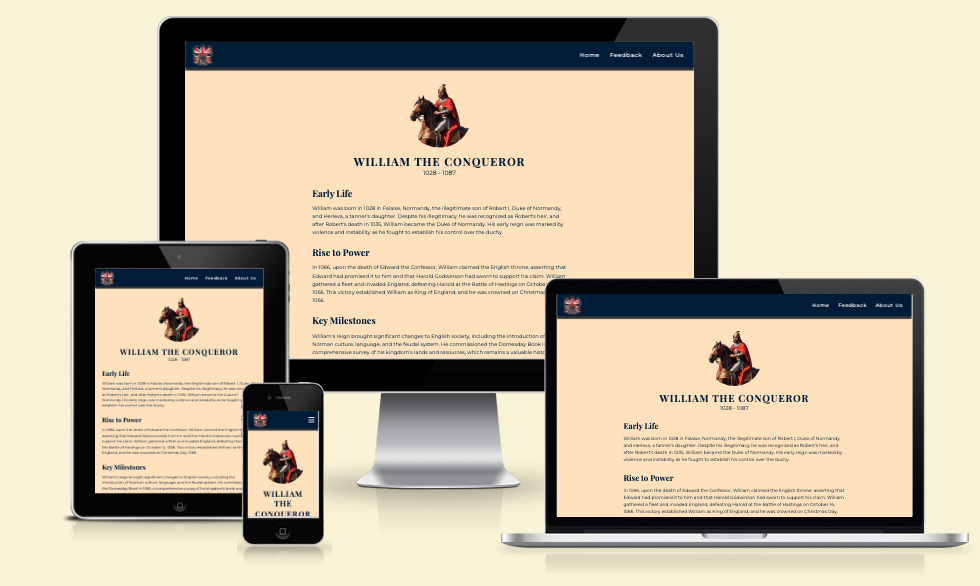
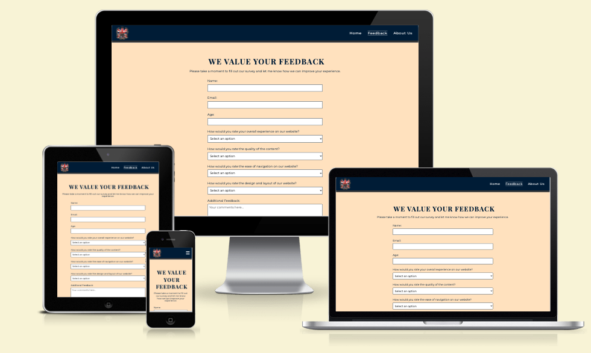
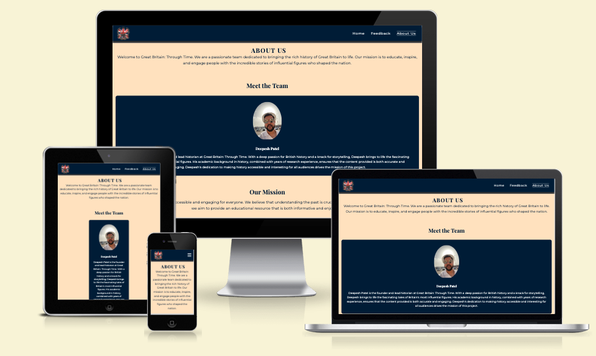

# Great Britain: Through Time



Visit the deployed site: [Great Britain: Through Time](https://deepeshpatel11.github.io/Great-Britain-Through-Time/)

## Overview

### Purpose

"Great Britain: Through Time" is a web application designed to educate and engage users by exploring the lives and legacies of ten influential figures who shaped the history of the United Kingdom. The application provides in-depth biographies, historical context, and high-quality images, making history accessible and interesting.

### Value to Users

- **Educational Resource**: Offers detailed and accurate historical information.
- **User Engagement**: Includes interactive elements such as feedback forms and embedded videos.
- **Cultural Appreciation**: Helps users appreciate the contributions of key historical figures to modern society.

## Features

### Home Page



The home page introduces users to the timeline of historical figures with an easy-to-navigate layout. The last section has an overview documentary embeded for users to further expand knowlegde on Great Britain's history.

### Biographies



Each biography page provides a detailed profile of a historical figure, including images, key milestones, their legacy and a short documentary on them.

### Feedback Form



The feedback form allows users to share their thoughts and suggestions, helping improve the website's content and user experience.

### About Us



The About Us page introduces the team behind the project and explains their mission.

## Installation

### Deployment Procedure

1. Clone the repository:

    ```sh
    git clone https://github.com/your-username/great-britain-timeline.git
    ```

2. Navigate to the project directory:

    ```sh
    cd great-britain-timeline
    ```

3. Open the `index.html` file in your preferred web browser.

## Code Attribution

### External Sources

- **Fonts**: Google Fonts are used for typography.

- **Icons**: Font Awesome is used for icons.

### Code Written for the Website

All other HTML, CSS, and JavaScript code is written specifically for this project.

## Development Process

### Version Control

This project uses Git for version control. The development process is documented through commits, which provide a history of changes made to the project. You can view the commit history on [GitHub](https://github.com/Deepeshpatel11/Great-Britain-Through-Time).

## Technologies

### Language Used
* HTML5
* CSS3

### Frameworks, Libraries & Programs Used
* [Git](https://git-scm.com/) - For version control.
* [Github](https://github.com/) - To save and store the files for the website.
* [GitPod](https://gitpod.io/) - IDE used to create the site.
* [Google Fonts](https://fonts.google.com/) - To import the fonts used on the website.
* [Google Developer Tools](https://developers.google.com/web/tools) - To troubleshoot and test features, solve issues with responsiveness and styling.
* [Favicon.io](https://favicon.io/) To create favicon.
* [Am I Responsive?](http://ami.responsivedesign.is/) To show the website image on a range of devices.


## Testing

### W3C Validator

[W3C](https://validator.w3.org/) was used to validate the HTML on all pages of the website. It was also used to validate the CSS.

1. Index page - Passed
2. William the Conquero page - Passed
3. Henry VIII page - Passed
4. Queen Elizabeth I page - Passed
5. William Shakepeare page - Passed
6. Oliver Cromwell Page - Passed
7. Sir Isaac Newton page - Passed
8. Adam Smith page - Passed
9. Queen Victoria page - Passed
10. Winston Churchill page - Passed
11. Margaret Thatcher page - Passed
12. Feedback page - Passed
13. About Us page - Passed
14. style.css page- Passed

###

### Solved Bugs 

| No | Bug | How I solved the issue |
| :--- | :--- | :--- |
| 1 | No padding in header visible despite css application | Corrected typo in CSS code on line 24. |
| 2 | Index page missing font awesome icon for menu toggle | Added the missing code. |
| 3 | Heading on icon landing page overflows | Corrected by adjusting the CSS targeting this element to be responsive. |
| 4 | After changing the content on index page from short biographs to famous quotes, images of icons were out of place | Corrected this by adding a margin bottom to the text-box class to keep a consistent design. |
| 5 | A design issue where icon images were not centrally aligned on mobile devices. | Via CSS added margin property to target ".container img" elements so the image was aligned |
| 6 | The previous fix, caused a design issue with larger screen sizes | Added a media query to only target the .container img elements, as no design issue with larger screens. |
| 7 | After testing HTML code for all pages on W3C validator, same x2 bugs found on index page and all icon landing pages: duplicate section tags used and redundant frameborder attribute in iframe for embeded videa | Removed the duplicate section element and redundant frameborder attribute. |

## Credits

### Code Used

* The design and structure of the header and footer were inspired by the Code Institute's "Love Running" walk-through project, I completed prior to project.
* The design of the timeline and animation when page loads was implemented using the [video tutorial](https://www.youtube.com/watch?v=t5AE66WgQD0) by GreatStack. I however adjusted the image placement for better UX.
* I designed the images to index page to become animated, when hovered upon. this was implemented using the [video tutorial](https://www.youtube.com/watch?v=SgmNxE9lWcY). I played with the attributes until I liked the design.

### Content

* All biographical text has been generated using ChatGPT for each of the historical figures.

### Media

* All images of historical figures & logo in header were generated using an [AI image generator](https://dezgo.com/text2image/sdxl)
* [Font Awesome](https://fontawesome.com/search?o=r&m=free) (for icons)
* [YouTube](https://www.youtube.com/) videos for documentaries are embedded to provide additional visual and educational content.
* Personal Image was uploaded for us in about us page.

### Acknowledgments

* My Code Insitute Mentor for guiding and supporting me throughout the development of my first project.
* Ioan Zaharia for supporting me when I had issues with Git and helping me resolve these.
* Tomáš Kubánčik for providing positive feedback.
* My friends and family for testing the responsiveness of the website on various devices and providing valuable feedback.

## Contributing

Contributions are welcome! To contribute:

1. Fork the repository.
2. Create a new branch (`git checkout -b feature-branch`).
3. Commit your changes (`git commit -m 'Add a new feature'`).
4. Push to the branch (`git push origin feature-branch`).
5. Open a pull request.

## Contact

Feel free to reach out via [GitHub](https://github.com/Deepeshpatel11) or [LinkedIn](https://www.linkedin.com/in/deepesh-patel-1b9747307/).

---

© 2024 Great Britain: Through Time. All rights reserved.
